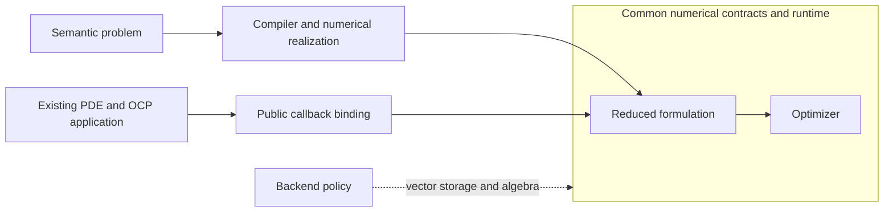
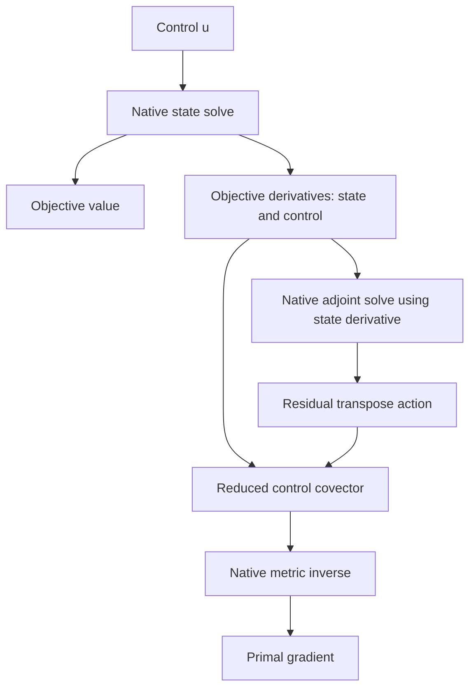
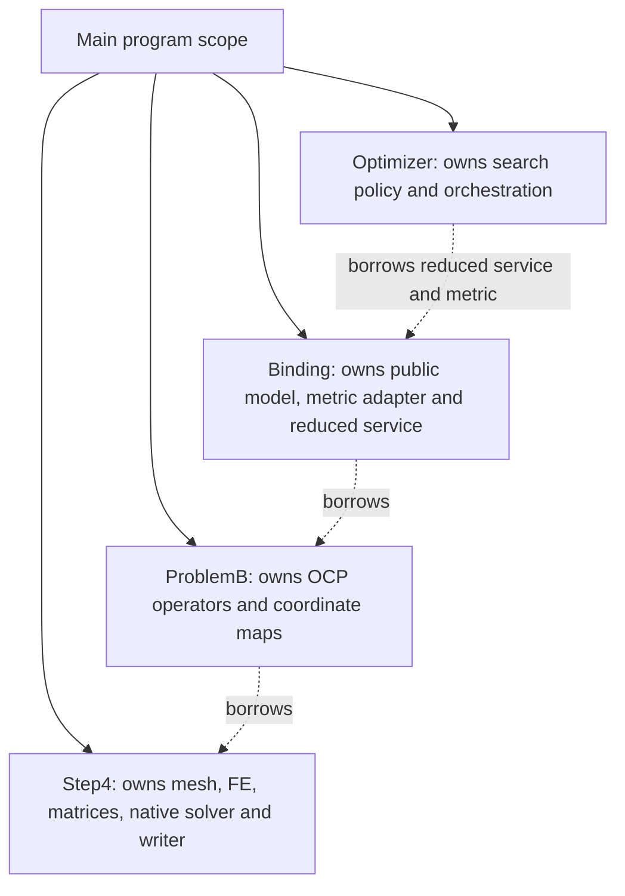

# How nmopt connects to an existing deal.II application

nmopt supplies the formulation and optimization machinery around a PDE
application's numerical operations. The application defines the equations,
objective, derivatives, and geometry; nmopt composes those operations into a
reduced objective and runs an optimization algorithm. Step-4 provides a
concrete example of that division of work.

In this case study, the deal.II tutorial keeps its finite-element
implementation, CG solver, and VTK output. Two optimal-control problems are
built around it, then connected through nmopt's public contracts. The second
problem adds FE distributed-control geometry while retaining the same pattern
of connection. This overview follows that problem from application setup to
one optimization step.

For the exact source changes and implementation sizes, use the
[implementation report](integration-report.md). For signatures and calling
conventions, use the [external API reference](../../../docs/reference/external-dealii-solver-integration.md).

## 1. Two ways to reach the same optimizer

The broader project aims to make combinations of PDEs, controls, observations,
objectives, metrics, constraints, and algorithms reusable. Its semantic path
starts with a problem description. A compiler realizes supported combinations
as numerical objects and provides the operations needed by a formulation.
An existing application can supply those operations directly.



This convergence is the architectural point of the external path. The
optimizer can use a reduced objective without knowing whether its equations
came from an nmopt compiler or an independently written application.
Step-4 enters through the callback binding. Its mesh and matrices remain in
the application, accessible to callbacks through captured references.
The dashed connection denotes the backend policy supporting numerical values
and algorithm operations. PDE operators and solve policies belong to the
numerical realization supplied by the compiler or application.

There are two levels of orchestration. The **formulation** knows how state
elimination and an adjoint produce a reduced derivative. The **optimizer**
knows how to choose directions, evaluate trial controls, accept steps, and
stop. The application implements the mathematical operations requested by
both levels. The [project blueprint](../../../docs/design/system-blueprint.md)
places these services in the wider semantic/compiler architecture.

## 2. Starting with a forward PDE solver

Step-4 solves a Poisson equation on a square in its 2D configuration. It
creates a mesh, distributes continuous bilinear finite-element degrees of
freedom, assembles the stiffness matrix and load vector, applies prescribed
Dirichlet data, solves with conjugate gradients, and writes the resulting
field. With four global refinements, the example has 256 cells and 289 DoFs.

Originally, the application exposes a public `run()` method that performs
this whole sequence. Its numerical methods and data are private. To reuse
its numerical work in optimization, the adapted version exposes preparation,
read-only numerical views, a solve accepting another RHS, and output
accepting another state. B also uses DoF-handler and boundary-value views.
The [source comparison](integration-report.md#1-step-4-before-and-after-adaptation)
shows the original class and the added interface.

These seams let a caller prepare the PDE once and solve it repeatedly. Step-4
still owns assembly, the sparse system, CG with identity preconditioning,
and the writer. The control problem decides what RHS to supply and what the
returned coefficients mean. A code that already offers callable assembly,
solve, and output operations may already have the corresponding reuse seams.

## 3. Adding the optimal-control problem

A forward solve determines a state for prescribed data. An optimal-control
problem introduces a variable control and asks which control produces the
best state according to an objective. That requires decisions about the
control space, its action on the PDE, the objective, derivatives, and gradient
geometry. These decisions belong to the application mathematics.

Problem A makes those additions deliberately simple. Using Step-4's already
boundary-treated matrix and RHS, it sets:

```math
Ay=b+u,\qquad
J(y,u)=\frac{1}{2}y^{\mathsf T}y+\frac{1}{2}u^{\mathsf T}u.
```

Both vectors have 289 entries and the control metric is the identity. This is
an algebraic RHS-control problem: control also changes the eliminated
boundary equations. A establishes a simple connection before introducing
physical FE control geometry.

Problem B represents a volume forcing control in the same continuous FE
basis and preserves the prescribed state boundary values. It has 289 control
coefficients but only 225 independent state coefficients. To distinguish the
independent state from the physical field, write:

```math
y_{\mathrm{phys}}=Pz+\ell.
```

Here $z$ holds the free coefficients, $P$ inserts them into a full vector,
and $\ell$ supplies the fixed boundary values. A state perturbation or adjoint
uses the homogeneous embedding $P$ without adding the boundary lifting.
These choices let the optimizer vary the control while the application
preserves the physical state boundary condition.

The FE mass matrix $M$ supplies two different pieces of mathematics. First,
it converts coefficients of the control field into a weak-form load. After
restricting to free equations, that coupling is $`B=P^{\mathsf T}M`$. Second,
it represents the selected integral squared norms in the objective:

```math
\begin{aligned}
Kz&=b_{F}+Bu,\\
J(z,u)&=\frac{1}{2}(Pz+\ell)^{\mathsf T}M(Pz+\ell)
       +\frac{1}{2}u^{\mathsf T}Mu.
\end{aligned}
```

The first term tracks the physical state toward zero; the second penalizes
the control. Boundary-node control coefficients still contribute to volume
forcing. The rectangular $B$ maps 289 control coefficients to 225 free state
equations. The load $`b_{F}`$ already contains Step-4's original lifting
correction.

[ProblemB](integration/problem_b.hpp) combines its
[coordinate map](integration/problem_b_coordinates.hpp),
[mass/coupling implementation](integration/problem_b_mass.hpp), and
[native metric](integration/problem_b_metric.hpp) around the prepared Step-4
application. The generic optimizer sees their operations through a binding.

## 4. What the public contracts mean

A useful way to understand the binding is to follow the mathematical objects
it describes. Begin with a point $x=(z,u)$ and an equation residual $E(x)$.
The full variable space contains a state block and a control block. The
residual acts on a test space. `BlockLayout` records those space identities
and dimensions, so a 225-entry state vector and a 289-entry control vector
cannot be interchanged accidentally at the contract boundary.

The vectors also have different mathematical roles. A **primal** represents
a state, control, perturbation, or adjoint test vector. A **covector** represents
a derivative or residual functional. `PrimalBlockT` and `CovectorBlockT`
carry native vectors with those roles and their layouts. The coefficient
pairing between a derivative and a perturbation gives a directional change;
it does not insert a mass matrix automatically.

`CallbackExecutableModelT` describes five operations: the residual, its
Jacobian-vector product (JVP), its transpose action (VJP), the objective, and
the objective derivative. B's residual callback returns a test covector.
Its VJP takes a test primal and returns the state and control covector
components. The binding unwraps native vectors, calls `ProblemB`, and wraps
the result with the appropriate layout. This is where the application's
operations acquire their public-contract representation.

Solving an equation is supplied separately from evaluating it.
`StateAdjointSolversT` contains two callbacks: a state solve at a control,
and an adjoint solve using the full point and state-objective derivative.
Each returns the native numerical result together with a convergence report.
B embeds its RHS into Step-4's full system, calls the native solver, and
restricts the answer. Its adapter translates the actual CG evidence; the
formulation checks that the declared solve converged.

The **metric** then turns a reduced derivative into a gradient. If $r$ is the
control covector, a metric $G$ defines $`g=G^{-1}r`$. For B, $G=M$, so $g$
represents the gradient in the selected FE mass geometry. The objective and
metric have separate roles: one says what is minimized; the other defines
the geometry used to turn derivatives into directions and measure norms.
B happens to use the mass matrix in both roles.

Finally, `ReducedDTOT` composes the model and solve callbacks into a reduced
objective and derivative, and `ReducedSearchSolverT` runs the chosen search
algorithm with a metric. The [B binding](minimal/problem_b_binding.hpp)
constructs these objects explicitly. Its local class keeps the references and
member order together; it is not a framework problem base class. The
[API reference](../../../docs/reference/external-dealii-solver-integration.md)
gives the exact signatures behind this explanation.

## 5. Following one evaluation and one step

Suppose the optimizer has a control $u$. It asks
`ReducedDTOT::evaluate_value(u)` for the reduced objective value. B first
builds the controlled RHS and solves for the free state $z$. It reconstructs
$Pz+\ell$ when evaluating the physical-state term of the objective. The
returned value retains the state, control, objective, and state-solve report.

To obtain a derivative, `augment_derivative(value)` reuses this state.
B computes the two objective covectors, then solves the adjoint equation:

```math
J_{z}=P^{\mathsf T}M(Pz+\ell),\qquad
J_{u}=Mu,\qquad K^{\mathsf T}p=J_{z}.
```

The adjoint combines the effect of state dependence without solving a
separate state-sensitivity problem for every control coefficient. The model's
residual pullback has control component $`-B^{\mathsf T}p`$. The reduced
formulation subtracts it from the objective's control derivative:

```math
r=J_{u}-E_{u}^{\ast}p=Mu+B^{\mathsf T}p.
```



B's native metric solves $Mg=r$. The selected steepest-descent policy takes
$d=-g$. Armijo tries a control displaced along that direction and compares
its objective with a sufficient-decrease bound. The bound uses the covector
pairing with the actual coefficient update:

```math
\delta u=u_{\mathrm{trial}}-u,\qquad
J(u_{\mathrm{trial}})\leq J(u)+c r^{\mathsf T}\delta u.
```

Here $J(u)$ denotes the reduced objective after solving the PDE. The optimizer
chooses trial steps and decides whether the inequality passes; the application
supplies the state and objective evaluations. A rejected trial does not need
an adjoint. Once a trial is accepted, its retained state is used to augment
the derivative. This split is a concrete service nmopt provides beyond
calling application functions in a fixed loop.

The optimizer also measures the gradient and accepted update in the selected
metric and applies its stopping policy. When it returns, the result contains
the final evaluation. The main program reconstructs that retained state and
passes it to Step-4's writer. Output therefore uses the state already computed
by the algorithm.

## 6. Ownership remains visible

The B main constructs the application, problem, binding, and optimizer in
that order. Their responsibilities are distinct:



The callback functions retain references to the existing problem. The
reduced service borrows the executable model; the optimizer borrows that
service and the metric. Keeping these objects in one scope makes their
lifetimes easy to follow. Native matrices and sparsity also retain the
lifetimes required by deal.II. There is no ownership transfer merely because
an operation becomes callable through nmopt.

A uses a slightly different local arrangement: `ProblemA` owns its prepared
Step-4 instance. Both arrangements meet the same downstream requirements.
The [reference lifetime section](../../../docs/reference/external-dealii-solver-integration.md#8-lifetime-rules)
details which values are copied and which objects are borrowed.

## 7. What changed from A to B

| Concern | A | B | Public connection |
| --- | --- | --- | --- |
| State/control sizes | 289 / 289 | 225 / 289 | Same layout and partition construction |
| Control action | Identity RHS addition | Rectangular FE mass coupling | Same residual/JVP/VJP callback slots |
| State boundary meaning | Algebraic probe | Fixed physical lifting | Coordinate operations remain in the application |
| Objective | Coefficient squared norms | Physical-state and control mass norms | Same objective and derivative slots |
| Gradient geometry | Identity | Consistent FE mass | Same metric interface, different native implementation |
| Numerical inversion | Native state/adjoint solves | Native state/adjoint and metric solves | Existing solve and metric contracts |

The mathematical realization becomes richer while the construction pattern
remains stable. B does not require a change to the shared optimizer or
compiler. Its minimal binding has 222 code-bearing lines compared with A's
206. The [implementation accounting](integration-report.md#4-source-accounting)
shows what those lines contain and separates them from OCP implementation
and the much larger evaluation machinery.

## 8. Why there is a backend

The optimizer needs vector operations such as copying a control, adding a
direction, scaling it, and pairing coefficients. It should not need to know
how a mesh was assembled to perform those operations. `SerialBackend`
provides primitive algebra using `dealii::Vector<double>`, while the generic
contracts and search algorithms are templated on the backend policy.

That is the distinction between **representation** and **PDE meaning**.
The backend supplies vector storage and algebra. B supplies mass and
stiffness actions, coordinate reconstruction, and solve policies. The
formulation combines derivatives and solves; the optimizer selects steps.
Sharing the same native vector type makes the connection direct, although
block construction and retained values can still copy vectors.

The wider deal.II implementation offers reusable metrics, coordinate maps,
and serial linear, KKT, and PDAS services, while generic solvers provide
multiple direction and line-search policies. These optional services fit the
same division of responsibilities; Step-4 retains its native PDE solves and
B's mass inverse. The [project blueprint](../../../docs/design/system-blueprint.md)
and [API reference](../../../docs/reference/external-dealii-solver-integration.md)
provide the broader framework map and current integration contracts.

One capability distinction matters here: Newton requires an explicitly
supplied reduced Hessian, while Step-4's steepest-descent/Armijo path does
not. Algorithm choice can therefore request additional operations, even
though construction of all five model callbacks remains mandatory. The
[reference](../../../docs/reference/external-dealii-solver-integration.md#5-metrics-and-optional-capabilities)
describes these requirements.

This modular separation was the useful inspiration from SUNDIALS: application
callbacks and data, vector operations, solve services, and numerical
orchestration have distinct roles. The official [CVODE introduction](https://sundials.readthedocs.io/en/latest/cvode/Introduction_link.html)
describes separate vector and linear-solver modules; the
[KINSOL usage guide](https://sundials.readthedocs.io/en/latest/kinsol/Usage/index.html)
describes user functions and context. The mapping to nmopt is an architectural
analogy, not a claim of matching API or capability coverage.

## 9. Connecting another application

| Step | Work to supply | Responsibility |
| --- | --- | --- |
| 1 | Make native assembly, solves, and output callable where needed | Existing application reuse |
| 2 | Choose control/state coordinates, coupling, objective, derivatives, adjoint, and metric | OCP mathematics |
| 3 | Check native equations and derivative actions | Application validation |
| 4 | Describe state, control, and test spaces with compatible layouts | Mathematical mapping into nmopt |
| 5 | Wrap the five model operations and two native solve services, with truthful reports | nmopt binding |
| 6 | Adapt the control metric and construct the reduced service | nmopt binding |
| 7 | Select the optimizer, policy, and initial control | Application algorithm choice |
| 8 | Inspect stopping evidence and reconstruct/write the retained state | Application output |

Use [minimal/problem_b.cc](minimal/problem_b.cc) to see the complete caller,
then its [binding](minimal/problem_b_binding.hpp) to inspect construction.
The [minimal README](minimal/README.md) provides runnable commands. The
[API reference](../../../docs/reference/external-dealii-solver-integration.md)
should answer exact type and lifetime questions without requiring the
experiment's history. Another application needs validation suited to its own
mathematics; it need not reproduce this evaluation's native optimizer or
attribution harness.

## 10. Evidence and current limits

The Step-4 case demonstrates the intended external path: an existing PDE
application retains its discretization and numerical services, defines its
OCP separately, and connects through the same reduced-formulation contracts
used by compiler-produced realizations. Moving from algebraic A to FE
distributed-control B substantially changes the application mathematics
while preserving the framework connection and requiring no shared nmopt
changes.

Native and nmopt versions of A/B passed matched evaluations and optimization,
independent equation/derivative/optimum audits, and native output comparisons.
The actual minimal executables are checked against audited native references.
The [closure audit](../../../docs/planning/review/external-dealii-boundary-evaluation/closure-report.md)
records the completed decision and the [implementation report](integration-report.md#7-evidence-and-reproduction)
locates the evidence and reproduction commands.

The tested cases are linear, symmetric, serial, fixed-mesh, and unconstrained
in the control. The present reduced contract supports one state, one control,
and one residual-test block. All five model callbacks are required even
though this first-order runtime does not use residual or JVP, and it computes
a full VJP whose state part is discarded. The binding is still verbose and
newcomer usability is unmeasured. These are the remaining limits of the
established external path; the architectural evaluation is closed.
