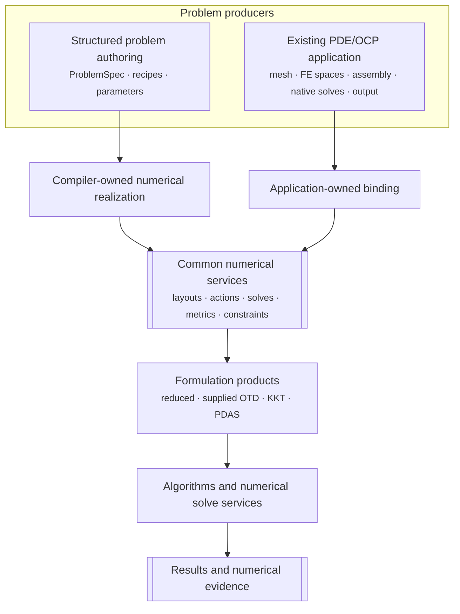
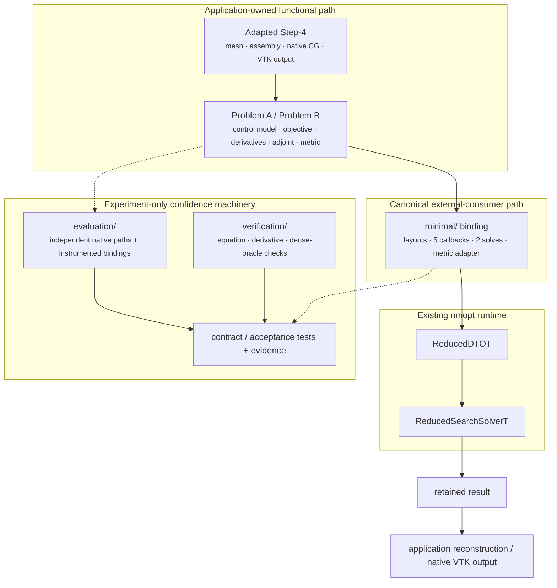
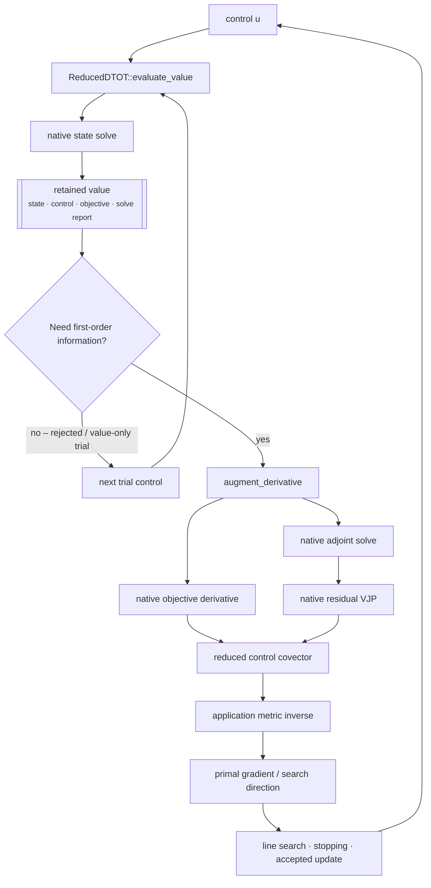

# Using nmopt as a library from an existing deal.II application

## Question and result

This experiment asks a narrow question that matters for a growing scientific-code
repository: does using `nmopt` as a library require rebuilding an existing deal.II
application around framework-specific abstractions, or can the application keep its
numerical implementation and connect through a bounded adapter?

For the two tested Step-4 optimal-control problems, the answer is the latter.

The authentic deal.II tutorial remains responsible for its mesh, finite-element
space, assembled operators, conjugate-gradient solve, boundary treatment, and VTK
output. Optimal-control mathematics is added outside the tutorial.
The canonical `nmopt` consumers then adapt those operations through existing
public contracts; they do not use the semantic compiler, project runner, native
comparison optimizer, or dense oracle, and they do not instantiate or exercise
the optional instrumentation machinery at runtime. The integration headers
still transitively expose the optional instrumentation type, but the canonical
minimal consumers pass no instrumentation object, execute no instrumentation
recording branches, and produce no instrumentation records.

Problem A establishes the simple case. Problem B is the stronger test: it introduces
free-state/full-control coordinates, fixed boundary lifting, a rectangular
finite-element control coupling, and a mass-matrix control metric. Those additions
substantially increase the application/OCP implementation while leaving the `nmopt`
binding shape almost unchanged: **206 code-bearing lines for A and 220 for B**.

This is a bounded result, not a claim that every deal.II application can be
integrated with the same amount of work. The tested cases are linear, symmetric,
serial, fixed-mesh, and unconstrained in the control.

For the wider project architecture, see the
[project overviews](../../../docs/manual/overview/README.md), especially
[Project architecture](../../../docs/manual/overview/project-architecture.md) and
[Integrating an existing PDE application](../../../docs/manual/overview/external-applications.md).
For exact source accounting and reproduction commands, use the
[implementation report](integration-report.md).

## 1. Where the experiment fits in nmopt

`nmopt` separates the producer of numerical PDE operations from the formulations and
algorithms that consume them. A supported problem can be described through the
semantic/compiler route, or an independently owned application can supply the same
kind of numerical services directly.



Step-4 exercises the right-hand producer path. The point is not that every
application must look like Step-4; it is that the downstream reduced formulation and
optimizer do not need to own or reconstruct the application's finite-element
implementation.

The experiment keeps the functional path and the confidence-building machinery
physically separate:



The dashed connections matter: comparison and verification code tests the boundary,
but it is not part of the minimal runtime an external application adopts.

## 2. Keep the costs separate

The experiment distinguishes four kinds of code:

| Layer | What it is | Count as `nmopt` integration burden? |
| --- | --- | --- |
| Existing PDE application | Step-4 mesh, FE assembly, CG solve, output | No |
| OCP mathematics | control coordinates/coupling, objective, derivatives, adjoint, metric | No – required by the chosen OCP regardless of optimizer library |
| Minimal `nmopt` binding | layouts, callbacks, solve adapters, metric adapter, reduced formulation | Yes |
| Evaluation support | independent native optimizer, instrumentation, dense audits, comparison tests | No active runtime/evaluation use; the optional instrumentation type remains a transitive source dependency |

This distinction is important because the complete experiment is intentionally large.
At the final implementation state, the minimal bindings contain **426 code-bearing
lines in total**, while comparison, verification, diagnostics, and test/evidence
support contain **10,256**. The latter exist to challenge and validate the claim; an
external consumer does not adopt their active runtime/evaluation machinery. The
optional diagnostics type remains a transitive source dependency through the
integration headers, but canonical minimal consumers instantiate no instrumentation.

## 3. Reusing the Step-4 application

The preserved Step-4 baseline is a forward Poisson solver whose public `run()`
performs setup, assembly, solve, and output as one sequence. Optimization needs to
reuse those numerical stages repeatedly.

The adapted source therefore exposes small native seams for:

- preparing and assembling the application once;
- viewing the assembled matrix and right-hand side;
- solving the existing system for a caller-supplied right-hand side while retaining
  native convergence evidence;
- writing a caller-supplied state through the original VTK path; and
- for Problem B, viewing the DoF handler and boundary data needed by the OCP layer.

The adapted source remains 244 code-bearing lines versus 191 in the stripped
baseline: a **net reuse adaptation of 53 lines**. No `nmopt` include or type appears
in that source. The standalone adapted program still runs the tutorial's original
forward sequence.

`integration/adapted_step4.hpp` is a four-line private seam that centralizes the
`STEP4_NO_MAIN` include protocol. Consumer code sees a named reuse boundary rather
than repeating the preprocessor sequence.

## 4. The OCP mathematics remains application-owned

A forward PDE solver is not yet an optimal-control problem. The control, objective,
derivatives, adjoint, coordinates, and gradient geometry must be defined somewhere
regardless of the optimization framework.

### Problem A – algebraic probe

Problem A uses the already boundary-treated Step-4 system:

```math
\begin{aligned}
Ay &= b + u, \\
J(y,u) &= \frac{1}{2} y^{\mathsf T}y + \frac{1}{2} u^{\mathsf T}u.
\end{aligned}
```

State and control both have 289 entries and the control metric is the identity. The
case is intentionally simple: it verifies the library boundary before adding more
realistic FE control geometry.

### Problem B – finite-element distributed control

Problem B preserves fixed physical state boundary values while using a distributed
control in the full continuous FE basis. It has 289 control coefficients but only
225 free state coefficients. With $P$ the free-to-full injection and $\ell$ the fixed
boundary lifting,

$$
y_{\mathrm{phys}} = Pz + \ell.
$$

The consistent FE mass matrix $M$ supplies the weak control coupling
$B=P^{\mathsf T}M$ and the selected $L^{2}$ geometry:

```math
\begin{aligned}
Kz &= b_{F} + Bu, \\
J(z,u)
  &= \frac{1}{2}(Pz+\ell)^{\mathsf T}M(Pz+\ell)
   + \frac{1}{2}u^{\mathsf T}Mu.
\end{aligned}
```

The application/OCP layer owns the coordinate map, lifting, mass and coupling
operators, residual and objective derivatives, state/adjoint solves, and native mass
metric. That work lives under `integration/`, not in the `nmopt` binding.

The progression from A to B is the main stress test:

| Concern | Problem A | Problem B | Effect on the public connection |
| --- | --- | --- | --- |
| State/control coordinates | 289 / 289 | 225 free state / 289 full control | Same layout/partition pattern |
| Control action | algebraic RHS addition | rectangular FE mass coupling | Same residual/JVP/VJP slots |
| State boundary meaning | algebraic probe | fixed physical lifting | Reconstruction stays application-owned |
| Objective geometry | coefficient squared norms | consistent-mass FE norms | Same objective/derivative slots |
| Gradient geometry | identity | consistent mass metric | Same `MetricT` boundary |
| Minimal binding size | 206 lines | 220 lines | Essentially stable despite richer OCP work |

## 5. What the `nmopt` binding actually adds

Each canonical binding performs the same explicit responsibilities:

1. describe state, control, and residual-test spaces with `BlockLayout`;
2. expose five native mathematical actions through `CallbackExecutableModelT`:
   residual, residual JVP, residual VJP, objective, and objective derivative;
3. expose native state and adjoint solves and translate their convergence evidence
   to `LinearSolveReport`;
4. select the state/control partition;
5. adapt the application's control metric to `MetricT`; and
6. construct `ReducedDTOT`.

The bindings do not reproduce the PDE or OCP algebra. Their callbacks unwrap native
vectors, call `ProblemA` or `ProblemB`, and wrap the returned values with the
appropriate primal/covector role and layout.

A and B remain separate on purpose. A uses an identity metric; B forwards its
application-owned mass metric and keeps the free/full coordinate distinction visible.
Hiding both behind a Step-4-specific generic helper would reduce the example LOC
without reducing the actual public-contract obligations.

The complete example executables contain 107 code-bearing lines for A and 112 for B,
but much of that is ordinary policy and program work: solver parameters, CLI/output
handling, reporting, and error handling. The actual use site is short: construct the
native problem, construct the binding, wrap the initial control, construct
`ReducedSearchSolverT`, call `solve`, and return the retained state to the
application's writer.

## 6. What `nmopt` provides after the connection

Once the binding exists, the application can use the same reduced formulation and
optimization machinery as other `nmopt` producers without teaching those layers
Step-4-specific PDE details.



The retained-value split is useful during globalization: rejected line-search trials
need a state solve and objective value but no adjoint; derivative augmentation is
performed when first-order information is actually requested. Metric application and
inverse application preserve the application's chosen control geometry. Final field
reconstruction and output remain native.

For the broader reduced-optimization lifecycle, see
[Reduced optimization](../../../docs/manual/overview/reduced-optimization.md).

## 7. SUNDIALS as an architectural inspiration

SUNDIALS provides a useful architectural reference point for this boundary because
it also separates application-owned numerical functions and data from reusable
solver orchestration. The comparison here is intentionally approximate: it is an
inspiration for responsibility boundaries, not a target for API shape, feature
coverage, or implementation maturity.

The correspondence is approximate:

| SUNDIALS-style concern | `nmopt` external-application analogue |
| --- | --- |
| application callbacks and user data | native residual/objective/derivative callbacks borrowing the existing OCP |
| vector implementation | `SerialBackend` operating on `dealii::Vector<double>` |
| linear/nonlinear solve services | application-owned state, adjoint, and metric solves |
| solver orchestration | `ReducedDTOT` plus `ReducedSearchSolverT` |
| application output and reconstruction | retained by Step-4 and the OCP layer |

The useful common principle is that adopting a solver library should not require the
application to surrender ownership of its discretization or numerical data merely to
make its operations callable. In this experiment, Step-4 continues to own its mesh,
matrices, native CG policy, and VTK writer; `nmopt` receives only the mathematical
operations and solve services needed by the formulation.

There are also important differences. `nmopt` exposes explicit primal/covector,
layout, metric, and reduced-formulation concepts because the project targets
PDE-constrained optimization rather than time integration or nonlinear-system solves.
The Step-4 experiment therefore should not be read as claiming API compatibility,
feature parity, or similar maturity with SUNDIALS. The useful comparison is the
ownership boundary: application callbacks and data stay application-owned, while the
library contributes reusable numerical orchestration.

For the SUNDIALS concepts referenced here, see the
[CVODE introduction](https://sundials.readthedocs.io/en/latest/cvode/Introduction_link.html)
and [KINSOL usage guide](https://sundials.readthedocs.io/en/latest/kinsol/Usage/index.html).
For the broader `nmopt` architecture, see the
[project overviews](../../../docs/manual/overview/README.md).

## 8. Evidence and current limits

The experiment does more than show that the minimal programs compile:

| Property | Evidence used |
| --- | --- |
| Forward fidelity | upstream, stripped, and adapted Step-4 outputs compared in both original dimensions |
| Native mathematics | off-solution residual/JVP/VJP checks and equation/derivative audits |
| Independent optimum | dense oracles and fresh final stationarity checks |
| Native/`nmopt` equivalence | matched reduced evaluations and matched optimization for A and B |
| FE metric | Problem B final stationarity checked with an independent dense mass solve |
| Consumer fidelity | actual minimal executables launched and their reports/VTK payloads checked against audited native results |
| Post-refactor reproduction | fresh A and B reproductions at `170c9f1` matched the historical numerical evidence; forward 2D/3D payloads also matched |
| Current routine gate | `debug-dealii` pipeline 178/178 at `170c9f1` with deal.II build jobs = 1 |

A post-closure reproduction on 2026-09-19 re-ran the historical comparison content
against the final refactored tree. Problem A passed 11/11 selected
native/public/minimal scenarios and Problem B passed 14/14. Reproduced objectives,
iteration and solve counts, residuals, gradients, oracle quantities, operation
ledgers, and metric records were identical to the historical values. Fresh VTK
payloads were also identical after ignoring generated timestamp headers.

The historical artifacts were not overwritten. The new evidence lives in separate
unique run directories and differs only in expected provenance such as paths,
timestamps, current commit/build metadata, and the current routine test inventory.
The
[closure report](../../../docs/history/reviews/external-dealii-boundary-evaluation/closure-report.md)
records the historical and post-closure evidence separately.

The experiment also exposes concrete limitations rather than hiding them:

- the cases are linear, symmetric, serial, fixed-mesh, and unconstrained;
- nonlinear/nonsymmetric PDEs, MPI, adaptivity, constrained or boundary controls,
  unrelated external applications, and package/install ergonomics are not tested;
- all five model callbacks are currently mandatory even though residual and JVP are
  not used by this successful first-order reduced runtime;
- the full residual VJP computes a state component that the reduced path later
  discards when extracting the control contribution;
- `MetricT::inverse_apply` returns the primal result but does not expose a public
  metric-solve report;
- newcomer authoring effort and the performance materiality of extra VJP/copy work
  were not measured; and
- the 206/220-line bindings are observations for these cases, not universal lower
  bounds.

## 9. Bottom line

The experiment supports a useful but deliberately limited conclusion: a real
application can remain the owner of its numerical PDE implementation while using
`nmopt` as a library. The application must still define its OCP mathematics, and the
current public boundary requires an explicit adapter, but the adapter is localized
and remains essentially stable when the example moves from the simple A probe to the
substantially richer FE Problem B.

The very large surrounding experiment should not be confused with that integration
cost. Most of its source exists to independently challenge, audit, attribute, and
reproduce the result. The detailed ownership and LOC breakdown is in the
[implementation report](integration-report.md); runnable consumer commands are in
[minimal/README.md](minimal/README.md).
