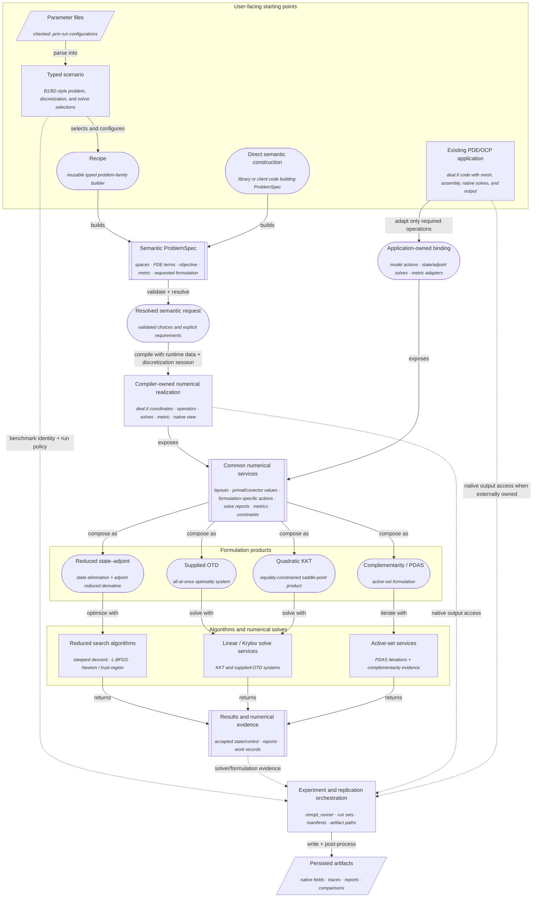
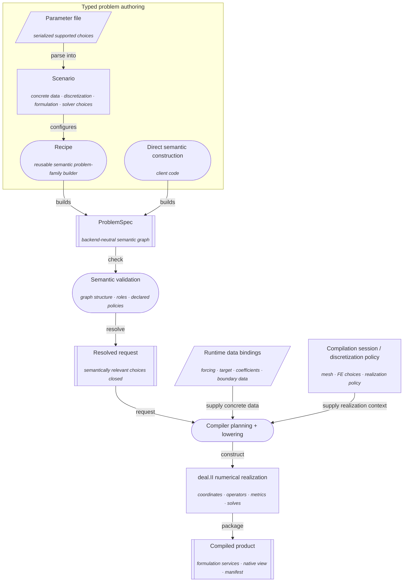
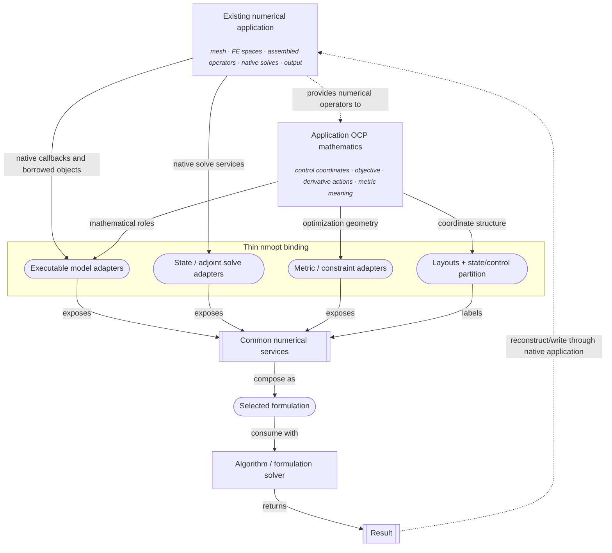
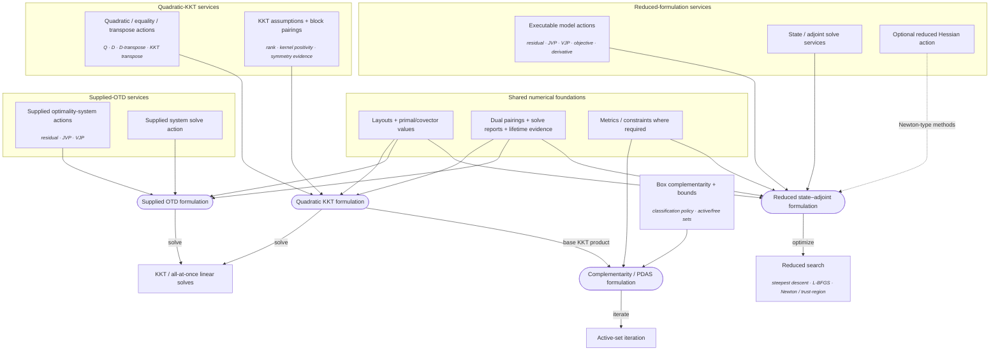
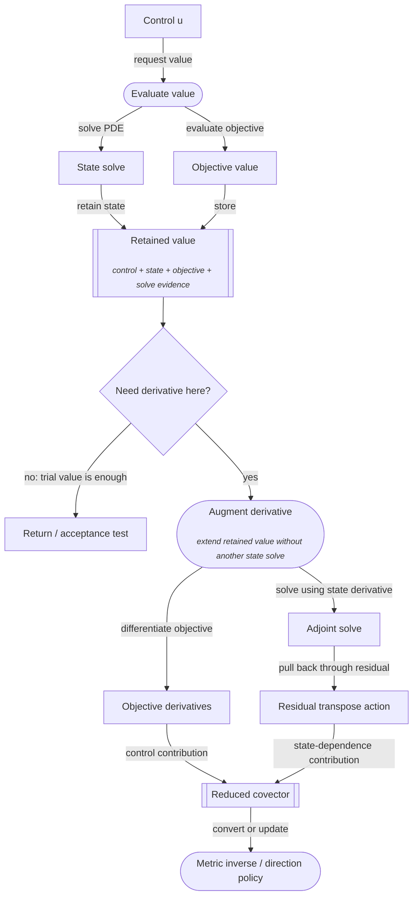
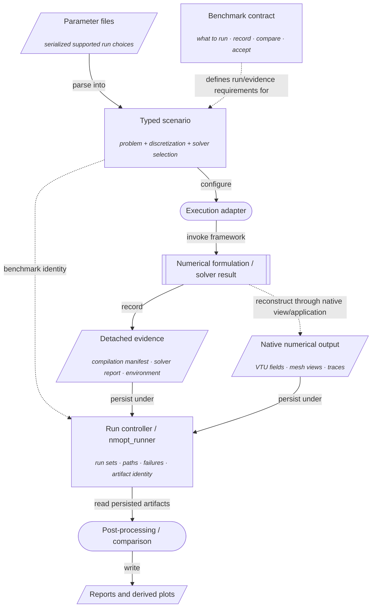

# Architecture maps

This page is the visual companion to the prose overviews.

The first map shows the widest project view. The later maps zoom into individual
parts of the same architecture rather than introducing alternative architectures.
Read them like a nested set of maps: start broad, then move inward only where you
need more detail.

The diagrams are for orientation rather than navigation. Mermaid rendering is not a
reliable place to encode repository links, so each map is followed by prose that
points to the relevant overview, reference, design, or source area.

## Visual legend

The maps use a small visual grammar consistently.

| Visual form | Meaning |
| --- | --- |
| Rectangle | An owned subsystem or application component |
| Rounded node | An adapter, formulation, or process-oriented service |
| Double-bordered node | A shared architectural boundary or product exposed downstream |
| Slanted node | Serialized/external input or persisted artifact |
| Solid arrow | Main construction, data, or execution flow |
| Dashed arrow | Orchestration, provenance, borrowing, or other side-channel relationship |
| Text on an arrow | The action connecting two nouns: validate, compile, adapt, expose, solve, record, and so on |

Where a node contains an example, the example appears after a blank line in smaller
italic text. It illustrates the category rather than defining it.

## 1. Master map

This is the detailed version of the simplified diagram in
[Project overview and architecture](project-architecture.md).



The initial subgraph deliberately contains both structured authoring and an existing
application. They are equally valid starting points. Parameter files, scenarios, and
recipes are *outer authoring conveniences* for the semantic path; an existing
application reaches the same common services through an adapter instead.

The experiment and replication layer is shown with dashed incoming edges because it
orchestrates selected uses of the numerical system rather than defining the PDE or
formulation.

Read [Project overview and architecture](project-architecture.md) for the prose
interpretation of the whole map.

## 2. Structured authoring and compiler path

This map zooms into the left side of the master map.



The recipe/scenario machinery is not the semantic language itself. A recipe is a
typed builder for a reusable problem family; a scenario freezes one concrete set of
problem and execution choices. Direct client code can build the same `ProblemSpec`
without either layer.

For prose, read [Describing and compiling a problem](semantic-compiler.md). The
detailed current capability ledger is
[`docs/implementation/v1/semantic-compiler.md`](../implementation/v1/semantic-compiler.md).

## 3. Existing-application integration path

This map zooms into the other producer path.



The important ownership rule is visible in the dashed relationships: the binding can
borrow application objects, but it does not become their owner. Output returns to the
native application because physical reconstruction may require its mesh, coordinate
maps, and writers.

For prose, read
[Integrating an existing PDE application](external-applications.md). The worked
deal.II example remains beside its source at
[`apps/external-dealii/step-4/external-integration-overview.md`](../../apps/external-dealii/step-4/external-integration-overview.md).

## 4. Shared foundations and formulation-specific products

This map zooms into the convergence point. The formulations share typed numerical
foundations, but they do not all consume one identical service bundle.



The distinction is deliberate. `ExecutableModelT` plus state/adjoint solves is the
current reduced service boundary. A supplied-OTD system instead owns its own
three-block residual/JVP/VJP/solve actions. The quadratic KKT product owns explicit
quadratic, equality, transpose, pairing, and assumption data. PDAS is built around a
KKT product plus box complementarity, metric/bound data, and active-set policy.

The commonality is therefore **typed numerical roles and composition rules**, not a
single universal formulation interface.

For the reduced path, continue with
[Reduced state–adjoint optimization](reduced-optimization.md). For exact
mathematical conventions, use
[Theoretical formalism](../design/theoretical-formalism.md).

## 5. Reduced evaluation lifecycle

This map zooms into one reduced evaluation and makes *derivative augmentation*
explicit.



The branch at **Need derivative here?** is the key runtime optimization. A rejected
line-search trial can stop after value evaluation. When a derivative is needed, the
retained state is augmented with adjoint-derived first-order information.

Read [Reduced state–adjoint optimization](reduced-optimization.md) for the equations
behind this map.

## 6. Experiment and evidence flow

This map zooms into the outer execution layer. It is intentionally downstream of the
numerical architecture.



A benchmark contract evaluates framework behavior; it is not the capability registry
for the compiler or formulation layers. This is why unimplemented B3–B6 benchmark
campaigns do not imply absent KKT/PDAS capability.

Read [Experiments and replication](experiments-and-replication.md) for the prose
model and the distinction among recipes, scenarios, parameter files, benchmarks, and
artifacts.

## 7. Source-tree orientation

The maps above describe responsibilities. The source tree is only an approximate
physical projection of those responsibilities:

```text
include/nmopt/contract/       common numerical types and formulations
include/nmopt/solvers/        reduced optimization algorithms
include/nmopt/semantic/v1/    semantic problem language and validation
include/nmopt/compiler/v1/    planning, lowering, and compiled products
include/nmopt/dealii/         vector backend + reusable deal.II numerical services
include/nmopt/application/    recipes, scenarios, adapters, runner support
include/nmopt/experiment/     detached experiment/provenance records

apps/external-dealii/         direct-integration case studies
apps/nmopt-runner/            repository experiment runner
parameters/                   checked run configurations
tests/                        contract, compiler, numerical, and application evidence
```

Do not infer architecture solely from directory names. `application/` mixes generic
orchestration with project-specific scenario code, and `dealii/` contains both the
narrow vector backend and richer numerical realization services. The prose overviews
explain those distinctions where they matter.
