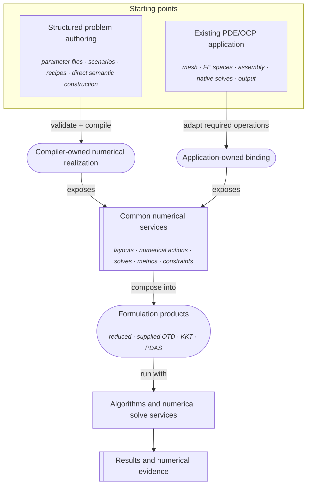

# Project overview and architecture

`nmopt` is a C++17 project for solving discretized PDE-constrained optimal-control
problems (PDE OCPs), with deal.II as the main finite-element environment.

The project is not a monolithic PDE solver and it is not a catalogue of hard-coded
optimization examples. Its central idea is to separate three kinds of work that are
often entangled in scientific codes:

1. **the application mathematics and numerical realization** – the PDE, objective,
   boundary conditions, finite-element spaces, assembled operators, and linear
   solves;
2. **the optimization formulation** – for example, how a state solve and an adjoint
   solve are combined into a reduced derivative; and
3. **the optimization algorithm** – directions, line search or trust-region logic,
   constraints, stopping, and reporting.

That separation lets the same reduced optimizer work with a problem assembled by
`nmopt`'s semantic/compiler path or with an independently written deal.II
application.

This page develops that picture from the problem being solved down to the main
repository areas.

## 1. The kind of problem nmopt represents

The common mathematical starting point is

$$
\min_{x \in X_{\mathrm{ad}}} J(x)
\qquad\text{subject to}\qquad
E(x)=0.
$$

Here $J$ is the objective, $E$ represents the governing equation or residual, and
$X_{\mathrm{ad}}$ is the admissible set for the optimization variables.

For a PDE optimal-control problem, the variable usually splits into a state and a
decision variable,

$$
x=(y,u),
$$

where the state equation

$$
E(y,u)=0
$$

implicitly determines $y$ from $u$.

A typical finite-element problem might ask for a distributed source $u$ such that
the PDE state $y$ follows a desired field while the control remains reasonably
small:

```math
\begin{aligned}
-\Delta y &= f + u && \text{in } \Omega, \\
y &= 0 && \text{on } \partial\Omega, \\
J(y,u)
&=
\frac{1}{2}\lVert y-y_{\mathrm{d}}\rVert_{L^{2}(\Omega)}^{2}
+
\frac{\beta}{2}\lVert u\rVert_{L^{2}(\Omega)}^{2}.
\end{aligned}
```

After discretization, the optimization code does not need the symbolic PDE itself.
It needs numerical operations representing the residual, objective, derivatives,
state and adjoint solves, and the chosen geometry of the control space.

That observation is the main architectural boundary in the project.

## 2. The project in one picture

There are two first-class ways to obtain the numerical services needed by a
formulation.

The structured path describes a supported problem and lets the framework construct
the deal.II realization. The direct path starts from an existing PDE/OCP application
that already owns its realization. Both converge before the formulation and
algorithm layers.



The two starting nodes are peers. The upper-left route is useful when `nmopt` should
construct the numerical problem from a structured description; the upper-right
route is useful when a mature application should retain ownership of its mesh,
operators, solves, and output.

The formulation box is deliberately plural. Reduced state–adjoint optimization is
well represented in the current executable examples, but supplied OTD, quadratic
KKT, and complementarity/PDAS products are also implemented framework capabilities.

[Architecture maps](architecture-maps.md) expands this diagram into a richer master
map and several zoomed views. The map collection also defines the visual legend used
there.

## 3. What nmopt owns, and what it deliberately does not own

A first-time reader can understand most of the repository by asking which layer owns
each decision.

### The application or compiler-side numerical realization owns

- the mesh and finite-element spaces;
- the meaning of state, control, test, and observation coordinates;
- the assembled PDE and objective operators;
- boundary-condition treatment;
- state and adjoint linear solves;
- application-specific field reconstruction and output.

For an external application, these objects remain in that application. For a
compiled problem, the compiler creates or packages the corresponding deal.II
objects.

### The formulation layer owns

- the mathematical sequence in which those operations are used;
- state elimination;
- adjoint-based derivative assembly;
- non-reduced optimality-system or complementarity organization for supported
  formulations.

For the main reduced path, the formulation knows that a reduced derivative requires
a state solve, objective derivatives, an adjoint solve, and a residual pullback. It
does not know how a stiffness matrix was assembled.

### The optimization layer owns

- search directions;
- metric-aware gradient operations;
- line search or trust-region decisions;
- projection and supported constraints;
- stopping criteria;
- iteration/work records.

It asks the formulation for values and derivatives. It does not assemble the PDE.

### The experiment and replication layer owns

- scenario selection;
- parameter-file parsing;
- benchmark run matrices;
- compilation and solver provenance;
- artifact directories;
- post-processing and reproduction bookkeeping.

This outer layer is important for the repository's reproducible experiments, but it
is not required in order to use the numerical library.

## 4. Two recurring examples

The overviews use two concrete examples to make the two entry paths less abstract.

**The Step-4 case study** starts from deal.II's tutorial program `step-4`, a small
Poisson finite-element application. The repository adapts it just enough to make
assembly, repeated solves, and output reusable, then builds optimal-control problems
around it. It represents the **existing-application** path.

**B1** is the repository's scenario ID for the distributed Laplace-control example
derived from Chapter 6 of *Optimal Control of Partial Differential Equations*
(Manzoni, Quarteroni, Salsa). It represents the “describe a supported problem and
compile it” path.

### 4.1 Existing application: adapted deal.II Step-4

The original Step-4 tutorial application already knows how to:

- build a mesh;
- distribute finite-element degrees of freedom;
- assemble a Poisson stiffness matrix and load vector;
- apply prescribed Dirichlet data;
- solve the linear system with conjugate gradients; and
- write the finite-element field.

`nmopt` does not replace those responsibilities.

The richer distributed-control case, called Problem B in the integration study,
adds a control, an objective, derivatives, and coordinate mappings that preserve the
physical boundary conditions. The physical state is reconstructed as

$$
y_{\mathrm{phys}} = Pz + \ell,
$$

where $z$ contains the independent state coefficients, $P$ embeds them into the full
finite-element vector, and $\ell$ contains the fixed boundary lifting.

The application also owns the finite-element mass matrix $M$. It participates in
both the distributed-control coupling

$$
B=P^{\mathsf T}M
$$

and, for this problem, the selected $L^{2}$ control metric.

The binding to `nmopt` exposes the numerical operations required by the formulation:

```text
control u
   │
   ├─► native state solve ─► state coordinates z
   │
   ├─► objective and objective derivatives
   │
   └─► native adjoint solve + residual transpose action
                              │
                              ▼
                     reduced control derivative
```

After that binding, the reduced formulation and optimizer do not need to know that
the operations came from Step-4.

The point of the example is architectural: **existing numerical ownership is
preserved; only the mathematical operations needed by the formulation are adapted.**
The general integration pattern is developed in
[Integrating an existing PDE application](external-applications.md). The detailed
coordinate dimensions and finite-element bookkeeping belong in
[Numerical realization](numerical-realization.md), where they are needed to explain
the algebra.

### 4.2 Semantic/compiler path: Chapter 6 B1

B1 is a distributed scalar-control example. At a high level, the application
selects:

- a scalar diffusion problem;
- homogeneous Dirichlet state data;
- a volume control;
- an $L^{2}$-type state-tracking objective;
- a positive control metric;
- a reduced state–adjoint formulation; and
- a reduced optimization method such as steepest descent or L-BFGS.

The semantic description records those choices without owning a deal.II mesh or
matrix. Runtime bindings provide the concrete functions and coefficients, while a
deal.II compilation session supplies the mesh and discretization context.

For this example, the framework-managed path is:

```text
B1 scenario
    │
    ▼
problem recipe
    │
    ▼
semantic ProblemSpec
    │
    ├─► validate and resolve
    │
    ├─► bind forcing / target / coefficients
    │
    └─► supply deal.II discretization session
             │
             ▼
      compiled numerical problem
             │
             ▼
      selected formulation + algorithm
```

This is a zoomed-in view of the semantic branch in the master diagram. The important
point is not B1 itself, but the separation between a reusable problem description,
concrete runtime data, numerical realization, and the downstream formulation.

The compiler is intentionally bounded. A semantically meaningful combination is not
automatically guaranteed to have an implemented deal.II lowering. The semantic
layer says whether the request makes sense; the compiler says whether this version
of the project knows how to realize it.

## 5. Why primal values, derivatives, and metrics are distinct

A subtle but central design choice is that the project does not silently identify a
derivative with a vector in the optimization space.

If $j'(u)$ is the derivative of the reduced objective, then

$$
j'(u)\in U^{\ast}.
$$

It acts on a perturbation $\delta u\in U$ through the dual pairing

$$
\langle j'(u),\delta u\rangle.
$$

A search algorithm usually needs a primal gradient $g\in U$. A metric
$G:U\rightarrow U^{\ast}$ supplies that identification:

$$
Gg=j'(u),
\qquad
g=G^{-1}j'(u).
$$

For a finite-element control, choosing the mass matrix as $G$ produces the gradient
associated with the discrete $L^{2}$ geometry. Choosing the identity produces a
different coefficient-space geometry.

This is why the core contracts distinguish primal values, covectors, pairings, and
metrics. The distinction is mathematical rather than stylistic.

## 6. The main runtime: reduced state–adjoint optimization

For a state-control problem, define the Lagrangian

$$
\mathcal{L}(y,u,p)
=
J(y,u)-\langle p,E(y,u)\rangle.
$$

Given a control $u$, the reduced formulation first solves

$$
E(y,u)=0.
$$

To compute the reduced derivative, it solves the adjoint relation

$$
E_{y}'(y,u)^{\ast}p = J_{y}'(y,u),
$$

then forms

$$
j'(u)
=
J_{u}'(y,u)-E_{u}'(y,u)^{\ast}p.
$$

The optimizer then uses the chosen metric and algorithm to propose the next control.

A useful runtime distinction is that **value evaluation** and **derivative
augmentation** are separate operations.

Value evaluation answers: *what state and objective value belong to this control?*
It performs the state solve and retains the resulting state together with the
objective value.

Derivative augmentation takes that already retained evaluation and adds the
first-order information needed by the optimizer. In this documentation,
*augmentation* means precisely this: extend an existing value evaluation with
objective derivatives, an adjoint solve, the residual pullback, and the resulting
reduced covector **without recomputing the state**.

```text
control u
   │
   ▼
state solve ─────────────────────► objective value
   │                                     │
   │                                     └─► sufficient for a trial-point test
   ▼
retained value
   │
   ├─► objective derivatives
   └─► adjoint solve
             │
             ▼
      residual pullback
             │
             ▼
      reduced derivative
```

This split matters during globalization. A line search can evaluate a trial control,
solve its state equation, and reject the trial using the objective value alone. An
adjoint is only needed when derivative information is requested, typically after a
trial has been accepted.

The [Reduced state–adjoint optimization](reduced-optimization.md) overview develops
this lifecycle, the metric conversion, and the search loop in more detail.

## 7. Formulation families and demonstration coverage

Reduced state–adjoint optimization is the easiest formulation to encounter in the
current executable examples because the external Step-4 case and the B1/B2
application work use it extensively. That should not be confused with the intended
scope of the framework.

The implemented formulation surface also includes:

- supplied **optimize-then-discretize (OTD)** optimality systems;
- equality-constrained **Karush–Kuhn–Tucker (KKT)** products;
- complementarity relations and **primal-dual active-set (PDAS)** services.

These are compiler and contract capabilities with focused tests and numerical
services. They are not placeholders for hypothetical future architecture.

What differs is **benchmark coverage**. The application work completed executable
B1/B2 campaigns first, while later B3/B4 active-set benchmarks and B5/B6
all-at-once/KKT benchmarks remained planned rather than receiving the same kind of
end-to-end execution and reproduction work. That history should not make the reduced
formulation appear to be the framework's only intended endpoint.

A better reading is:

```text
framework capability
├─ reduced state–adjoint formulations
├─ supplied OTD formulations
├─ quadratic KKT formulations
└─ complementarity / PDAS formulations

current project demonstrations
├─ external Step-4 integration → reduced path
├─ B1 benchmark               → reduced path
├─ B2 benchmark               → reduced path
└─ planned later benchmarks   → PDAS / KKT / all-at-once paths
```

The benchmark cases exist to exercise and evaluate framework capabilities. They are
not the architecture's definition of success or its final product catalogue.

## 8. Backend means vector algebra, not PDE realization

The word *backend* is intentionally narrow in this project.

A backend policy supplies the vector representation and primitive algebra required by
generic contracts and optimizers: allocation, copying, scaling, addition, dot
products, and coefficient access.

For the serial deal.II backend, the underlying vector type is
`dealii::Vector<double>`.

The backend does **not** decide:

- which finite-element space is used;
- how Dirichlet conditions are represented;
- how a state equation is assembled;
- what the mass matrix means;
- how an adjoint is solved.

Those are numerical-realization responsibilities.

This distinction matters when reading the source tree: `include/nmopt/dealii/`
contains both the narrow backend policy and reusable deal.II numerical services, but
those are conceptually different roles.

## 9. Ownership remains typed even when solver interfaces are generic

Optimization code benefits from a small generic interface. Finite-element
applications, however, need concrete typed objects for reconstruction, output, and
lifetime management.

`nmopt` therefore does not try to erase all application ownership.

A compiled problem keeps a typed native view alongside the solver-facing
formulation services. An external application simply keeps its own native objects.
The optimization layer may only see callable numerical operations, while the outer
application can still access the original mesh, dimensions, fields, and writers.

A useful rule for the repository is:

> Type erasure is a solver boundary, not an ownership boundary.

## 10. How the repository is organized

The main reusable source areas are:

```text
include/nmopt/
├── contract/      mathematical values, executable operations, formulations
├── solvers/       reduced optimization algorithms
├── semantic/v1/   backend-neutral problem descriptions and validation
├── compiler/v1/   semantic-to-deal.II lowering and compiled products
├── dealii/        vector backend plus reusable deal.II numerical services
├── application/   scenarios, recipes, execution adapters, runner support
├── experiment/    detached provenance/evidence records
└── reference/     dense/reference systems used for verification
```

The surrounding repository provides concrete applications and evidence:

```text
apps/              executable applications and external-integration examples
parameters/        checked parameter-file families
tests/             contract, semantic, deal.II, and application verification
docs/              design, reference, application, benchmark, and review records
```

The important hierarchy is conceptual, not simply directory-based. For example,
`application/` contains both generic orchestration support and Chapter-specific
project code, while `dealii/` contains both primitive backend support and richer
finite-element services.

## 11. Which layer should own a new use case?

The architecture is most useful when it gives contributors a default place for new
work rather than only describing the current files.

| You are trying to add or reuse… | Start here | Architectural rule |
| --- | --- | --- |
| An existing mature PDE/OCP code | External-application integration | Preserve native numerical ownership; adapt only the operations needed by the formulation. |
| A reusable supported PDE/OCP family | Semantic model + compiler + numerical realization | Put mathematical choices in semantics, concrete deal.II construction in the compiler/realization layer, not in the optimizer. |
| A new optimization algorithm | Contracts + solver layer | Consume formulation services; do not branch on PDE family or benchmark ID. |
| A new benchmark or reproduction study | Recipe/scenario + experiment/replication layer | Exercise existing framework capabilities and record evidence; do not create benchmark-specific numerical architecture unless the capability itself is genuinely missing. |
| A new parameter-file option | Outer application/configuration layer | Map text input to typed choices; a parameter file must not silently invent new semantic or compiler behavior. |

The recipe/scenario layer and the semantic/compiler layer are related but not
identical. Recipes are typed builders for reusable application problem families.
Scenarios select concrete problem, discretization, data, and solver choices for a
run. Both can produce or configure semantic problems, but the semantic graph is the
framework-level description consumed by validation and compilation.

The experiment/replication layer sits above those choices. It gives them benchmark
identity, file-based configuration, run organization, provenance, and post-processing.
It should remain possible to use the semantic/compiler path without the runner, just
as it should remain possible to use the reduced optimizer with an external
application without constructing a `ProblemSpec`.

### If you already have a PDE application

Use the external-application route when the existing code should remain authoritative
for mesh, assembly, state/adjoint solves, and output. Start with
[Integrating an existing PDE application](external-applications.md).

### If you want framework-managed construction

Use the semantic/compiler route when the problem fits the registered problem
families and you want the framework to construct the deal.II realization from an
explicit problem description. Start with
[Describing and compiling a problem](semantic-compiler.md).

### If you are extending the repository's experiments

Use the recipe/scenario/benchmark machinery when the numerical capability already
exists and the task is to exercise, compare, reproduce, or document it. Start with
[Experiments and replication](experiments-and-replication.md).

## 12. Current scope and limits

The current reduced formulation is intentionally narrower than the abstract
mathematics: it represents one state block, one decision block, and one residual
test block.

The semantic compiler is also a registered finite set of supported problem and
realization combinations rather than a symbolic PDE compiler.

Those limits are part of the current project shape. The architecture is meant to
make supported combinations explicit and reusable, not to imply arbitrary PDE
coverage.

## Read later: authoritative sources

The other overview pages deepen one part of this mental model:

- [Integrating an existing PDE application](external-applications.md)
- [Semantic and compiler path](semantic-compiler.md)
- [Numerical realization](numerical-realization.md)
- [Reduced state–adjoint optimization](reduced-optimization.md)
- [Experiments and replication](experiments-and-replication.md)

For authority beyond the overview layer:

- [Theoretical formalism](../design/theoretical-formalism.md) defines the project's
  mathematical conventions.
- [PDE, formulation, and solver boundary](../design/pde-solver-boundary.md) records
  the accepted ownership and integration rules.
- [Composition boundaries](../design/composition-boundaries.md) gives the more
  prescriptive subsystem composition rules.
- [v1 semantic compiler](../implementation/v1/semantic-compiler.md) is the detailed
  current compiler capability ledger.
- [External deal.II solver integration](../reference/external-dealii-solver-integration.md)
  gives exact contracts for the direct-application path.
- [Application execution](../reference/application-execution.md) and
  [Parameter files](../reference/parameter-files.md) describe the repository's
  reproducible execution layer.

For exact current C++ signatures not yet covered by a dedicated reference page, the
public headers under `include/nmopt/` and their focused tests remain the implemented
authority.
